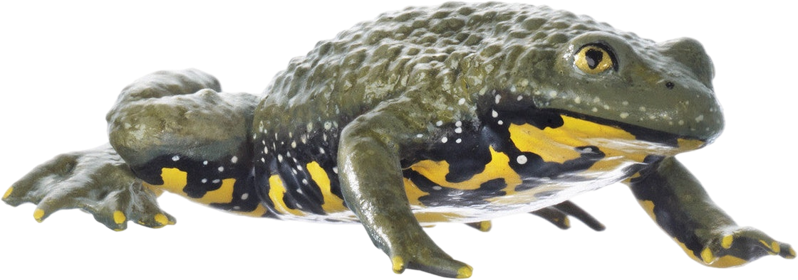
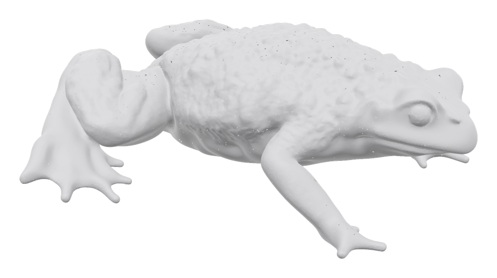
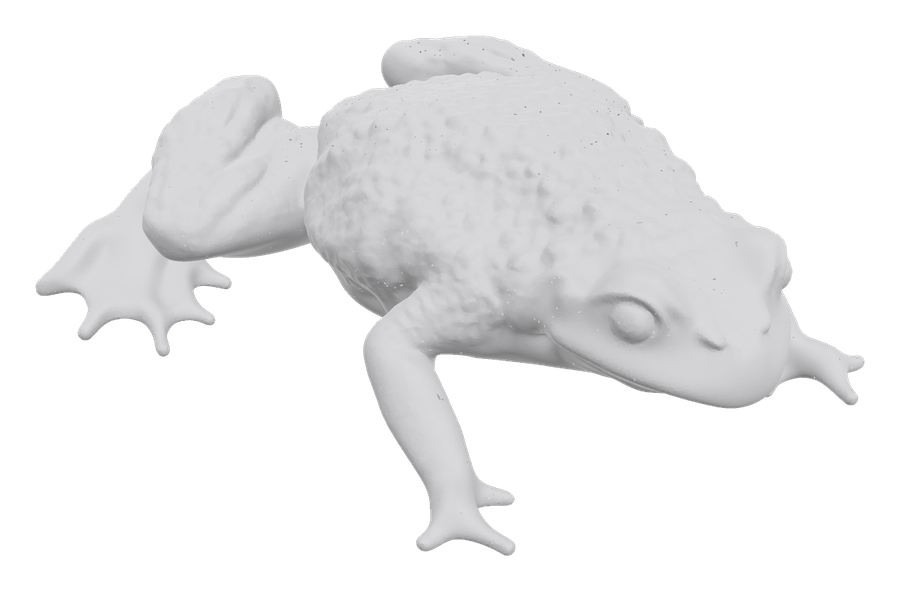
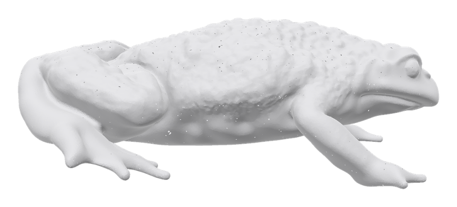

# Solidify

**Photo in, printable object out.**

Point a camera at something and get a mesh a 3D printer will actually accept.

Solidify is the image-to-3D system running at the
[ICTP SciFabLab](https://www.ictp.it/scifablab). A visitor uploads a photo; a
few minutes later they have a watertight STL. It runs on a Mac in the corner of
the lab, on a version of the generative model I fine-tuned to produce cleaner
geometry, behind a repair pipeline that reports what it is doing and why.

The name is what the pipeline does: *solidify* is the step that takes a hollow,
broken shell and floods its interior until it is a closed solid. It started as
a function name and ended up as the name of the whole thing.

<p align="center">
  
  &nbsp;&nbsp;&rarr;&nbsp;&nbsp;
  
</p>

<p align="center"><em>One photo in, this mesh out. Generated by the fine-tuned
model, rendered straight from the pipeline &mdash; no cleanup, no Blender.</em></p>

It is built on Microsoft's TRELLIS.2 and on an Apple Silicon port of it. What
came from where is set out in [THIRD_PARTY.md](THIRD_PARTY.md), and verifiable
with one `git diff`.

---

## Why this exists

TRELLIS.2 makes beautiful meshes. It does not make *printable* ones.

Its raw output is a visual artefact: edges shared by three or more faces,
thousands of disconnected shells, boundaries that never close. A slicer needs a
closed, orientable, manifold surface. Hand a slicer the raw output and it
refuses, or silently produces something that fails on the bed.

Two things here address that, at opposite ends of the pipeline.

**Generate better geometry in the first place.** A LoRA fine-tune of the
shape-SLat flow model, trained on 300 clean, watertight Thingi10K solids, so
the model's prior shifts toward closed geometry.

| | non-manifold edges | loose components | detail |
|---|---:|---:|---:|
| stock TRELLIS.2 | 0.923% | 6,301 | 0.772 |
| **fine-tuned** | **0.515%** | **3,800** | 0.784 |
| | **−44%** | **−40%** | unchanged |

Raw model output, no repair applied — this is the model getting better, not a
post-process cleaning up after it. Detail is flat, so the gain is not bought by
smoothing the mesh into a blob. Full method and per-image results:
[comparison report](report/comparison_900_vs_300_vs_base.md).

**Repair whatever still comes out broken.** A five-rung ladder that escalates
only as far as it has to, because every rung costs something:

| rung | method | cost if it runs |
|---|---|---|
| 1 | Manifold3D accepts it as-is | nothing |
| 2 | PyMeshLab repairs non-manifold edges | nothing — original triangles kept |
| 3 | fan-patch small boundary loops | nothing — only adds triangles across holes |
| 4 | MeshLib SDF rebuild | surface resampled; finest detail lost |
| 5 | binary voxel remesh | coarsest; rebuilt from a grid, UVs gone |

The user watches this happen. Each escalation says which method is being tried,
why the previous one was abandoned, and what it costs in quality — rather than
a spinner and a mesh that is quietly worse than expected.

---

## What it looks like

<p align="center">
  
  
</p>

Three progress bars, one per real stage — sparse structure, latent refinement,
repair — each driven by that model's own step count rather than a timer. The
shape appears while it is still generating, decoded early and cheaply so there
is something to look at and rotate.

If a job fails, it says why, and the raw unrepaired geometry is still
downloadable.

---

## Quick start

Requirements, all of them hard:

- an Apple Silicon Mac (M1 or newer) running macOS
- **24 GB+ unified memory** — the model is 4B parameters
- Python 3.11 or newer, and ~15 GB of disk for model weights
- a HuggingFace account, plus **manually approved access to two gated models**:
  [DINOv3](https://huggingface.co/facebook/dinov3-vitl16-pretrain-lvd1689m) and
  [RMBG-2.0](https://huggingface.co/briaai/RMBG-2.0). Approval is usually
  instant, but request it *before* running setup — otherwise the failure
  surfaces deep inside a pipeline load and looks like a bug.

```bash
git clone https://github.com/acidbled101/Solidify.git
cd Solidify

xcodebuild -downloadComponent MetalToolchain   # optional; faster texture bake
hf auth login                                  # after approving both models above

bash setup.sh                                  # venv, deps, clone + patch TRELLIS.2
source .venv/bin/activate

# the fine-tuned model (75 MB). Skip it and you get stock TRELLIS.2.
hf download acid101/trellis2-slat-lora --local-dir adapters/
```

Then either the command line:

```bash
python generate.py photo.jpg              # photo -> mesh
python make_printable.py output_3d.glb    # mesh -> printable mesh
```

or the web app:

```bash
python -m server.admin add alice          # create a login
./run_server.sh                           # http://localhost:8000
```

`SKIP_METAL=1 bash setup.sh` skips the Metal build and falls back to a slower
pure-Python texture baker.

---

## Running it somewhere else

### On another Mac

Follow Quick start. Configuration is entirely environment variables, read by
`run_server.sh`:

| variable | default | what it does |
|---|---|---|
| `TRELLIS_MODEL_VARIANT` | `tuned` | `tuned` or `base` — switch the fine-tune off |
| `TRELLIS_ADAPTER_PATH` | `adapters/sft-1200-1050.pt` | which adapter to load |
| `TRELLIS_PIPELINE_TYPE` | `1024_cascade` | `512`, `1024`, or `1024_cascade` |
| `TRELLIS_NO_TEXTURE` | `1` | geometry only; much faster |
| `TRELLIS_DEVICE` | `mps` | |
| `TRELLIS_HOST` / `TRELLIS_PORT` | `0.0.0.0` / `8000` | |

**One uvicorn worker only.** Each worker would hold its own TRELLIS pipeline
and they would contend for the single GPU, so the server runs one job at a time
by design. Do not add `--workers`.

### On a CUDA box, to train

Fine-tuning takes about 116 hours on the Mac and an estimated 3–6 hours on one
A100. Everything needed to rent a GPU box and run it from a notebook is in
[`training/cuda/`](training/cuda/README.md), including a correctness gate that
should be run once before training — it catches a batching bug that silently
corrupts the loss by 6.5% on non-flash-attention backends.

### As an always-on service

[`launchd/`](launchd/README.md) has the two LaunchAgents the lab machine runs:
one keeps the server up, the other is a watchdog for the case `KeepAlive`
cannot see — a process that is alive but wedged with the GPU stuck.

Two caveats. The plists **hardcode absolute paths**, because launchd does no
variable expansion in `ProgramArguments`; a different user or checkout location
means editing them. And surviving a power cut needs `sudo pmset -a autorestart 1`
by hand.

---

## A worked example

The toad at the top of this page, start to finish. Input is
`server/static/assets/frog.png`, a single photo.

### Generate

```console
$ python generate.py server/static/assets/frog.png --pipeline-type 512
[SPARSE] Conv backend: none; Attention backend: sdpa
pipeline loaded in 91s
Sampling sparse structure: 100%|██████████| 12/12 [01:42<00:00,  8.51s/it]
Sampling shape SLat:       100%|██████████| 12/12 [00:54<00:00,  4.52s/it]
Sampling texture SLat:     100%|██████████| 12/12 [00:27<00:00,  2.32s/it]
  Rasterizing 499,999 triangles into 1024x1024...
  Final coverage: 100.0%, total bake: 10.3s
DONE in 332s
```

Measured on an M4 Pro with `SPARSE_CONV_BACKEND=none` — the pure-PyTorch
fallback, because `flex_gemm` was not installed on that machine. With the Metal
stack the sparse-structure stage is several times faster; that stage is 102s of
the 332s here. Pipeline load is a one-time cost per process, so batching images
in one run pays it once.

### Repair

Feed the raw mesh to the ladder:

```console
$ python make_printable.py output_3d.glb
Mesh: 647,653 vertices, 1,297,678 faces, watertight=False
  Split: 7887 raw components -> kept 1 large object (removed 7886 noise/small)

Repairing geometry...
  --solid-infill requested; voxelizing to eliminate internal cavities...
Repaired in 50.5s: 2,911,086 vertices, 5,834,576 faces, watertight=True
  Voxel remesh inflated faces to 5,834,576; re-simplifying to ~1,000,000...

Fidelity report (shape deviation from post-processing, vs. original):
  Chamfer distance (avg deviation):     0.01417  (0.98% of model size)
  Hausdorff distance (worst deviation): 0.16758  (11.58% of model size)

Printability report (heuristic, not exhaustive):
  Overhang area (> 45 deg from vertical): 15.1% of surface
  Thin-wall warnings (< 1.0mm, sampled 500 rays): 498

Saved: output_3d_printable.glb
Saved: output_3d_printable.stl
```

Note what the fidelity report is for: the repair moved the surface by 0.98% of
the model's size on average, and 11.58% at the single worst point. That is the
price of `watertight=True`, and the tool reports it rather than hiding it.

### Measure the topology

Generate the same photo again with `--no-texture`, then:

```console
$ python -m evaluation.topology_test --mesh output_3d.glb
  faces              1,165,658
  open_rate              0.775%
  nonmanifold_rate       0.430%
  components             2,452
```

**That `--no-texture` is not optional if you care about the number.** The
textured export of this same toad, from the same model and the same seed,
reports **46.767% open edges and 68,376 components** — xatlas splits vertices
along every UV seam, so connectivity is shredded while the shape is untouched.
Every figure in this repository is measured on geometry-only output; see
[`evaluation/README.md`](evaluation/README.md).

### Compare against the untrained model

```console
$ python -m evaluation.compare_models \
      --images server/static/assets/frog.png \
      --models base sft-1200-20260806-0119@1050
```

Writes one raw mesh per model plus a topology table. It samples the sparse
structure **once** and reuses it for every model, and seeds the SLat noise per
photo, so the comparison is paired by construction — the only thing varying
between the rows is the weights. That is how the numbers above were produced.

---

## How it fits together

```
photo
  ├─ background removal (RMBG-2.0) + features (DINOv3)
  ├─ sparse structure flow   ── which voxels are occupied
  ├─ shape SLat flow         ── the fine-tuned stage; LoRA loads here
  ├─ decode                  ── sparse latents to a dual grid to a mesh
  └─ repair ladder           ── rungs 1-5, until a slicer will accept it
       └─ watertight STL / GLB
```

| directory | what it is |
|---|---|
| [`trellis_core/`](trellis_core/) | inference and repair; what the server and CLIs import |
| [`trellis_core/printprep/`](trellis_core/printprep/) | the repair ladder |
| [`server/`](server/) | the web app — auth, job queue, live progress |
| [`training/`](training/README.md) | the fine-tune and the dataset pipeline |
| [`evaluation/`](evaluation/) | topology metrics, checkpoint comparison |
| [`experiments/`](experiments/dpo_inference_steering/README.md) | a concluded experiment, kept for the record |
| [`third_party/`](third_party/) | **not my work** — the Apple Silicon port |

---

## The model

`adapters/sft-1200-1050.pt` — LoRA rank 16, alpha 32. 18.68M trainable
parameters across 210 modules of a frozen 1.29B-parameter flow model. Trained
with supervised flow matching on 300 Thingi10K solids for 8.7 epochs.

The adapter is additive with a zero-initialised B matrix, so switching to
`base` is bit-exact — the fine-tune is genuinely *off*, not merely blended
away.

**Scope limit, stated plainly:** the adapter was trained and measured on
`shape_slat_flow_model_512`. The default `1024_cascade` pipeline runs a second,
*untuned* refinement stage afterwards, and whether the −44% survives that has
not been measured. Both checkpoints are architecturally identical, so the
adapter will load into the 1024 model without complaining — do not do that. It
would fail silently.

How the training data was built, and how to rebuild it exactly, is in
[`training/README.md`](training/README.md).

---

## What did not work

[`experiments/dpo_inference_steering/`](experiments/dpo_inference_steering/README.md)
is a preference-steering approach I built, measured over 22 recorded runs, and
retired: intercept the sampling trajectory mid-flight, fork two candidates,
score them with a physics-aware judge, and steer toward the better one — no
training, no preference dataset. About 6,000 lines and 60 tests.

It is kept, with its closing report, because the measurements are the useful
part. The weight-space fine-tune above is what replaced it.

---

## Credits

The frontend's visual design — the sci-fi treatment, the layout, the whole look
of the app — is by **Ajlan AlAjlan**. Everything behind it is mine.

Built on [TRELLIS.2](https://github.com/microsoft/TRELLIS.2) by Microsoft
Research, and on [Shivam Kumar's Apple Silicon port](https://github.com/shivampkumar/trellis-mac)
of it, which is preserved in [`third_party/`](third_party/) — see
[THIRD_PARTY.md](THIRD_PARTY.md) for exactly what came from where.

## Licence

Solidify's own code is MIT — see [LICENSE](LICENSE).

**The models it runs are not, and two of them restrict what you may do with the
output.** Full texts are in [`licenses/`](licenses/README.md):

| model | licence | commercial use |
|---|---|---|
| TRELLIS.2-4B | MIT | yes |
| DINOv3 | [Meta DINOv3 Licence](licenses/DINOv3-LICENSE.md) — custom, not open source | read the licence |
| RMBG-2.0 | [CC BY-NC 4.0](licenses/CC-BY-NC-4.0.txt) | **no** — needs a licence from [BRIA](https://bria.ai/) |

RMBG-2.0 is the binding constraint: it is non-commercial, it runs on every job,
and there is no code path around it, since background removal happens before
the model sees the image. A commercial deployment needs BRIA's permission
regardless of this repository's MIT licence.

Training data has its own terms again — 300 Thingi10K models under per-object
Creative Commons licences, 11 No-Derivatives and 94 non-commercial. See
[`data/thingi10k_sft/ATTRIBUTION.md`](data/thingi10k_sft/ATTRIBUTION.md).
